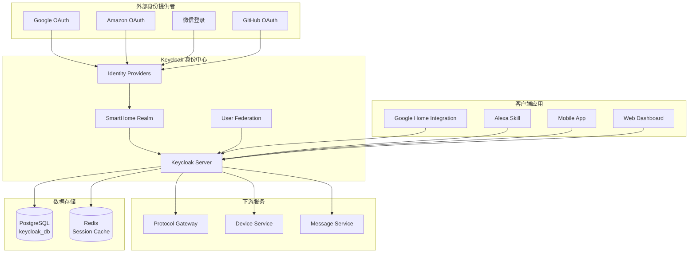
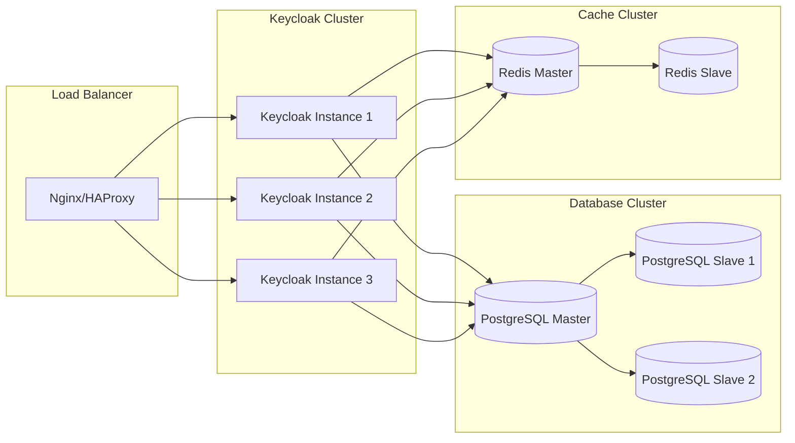

# 身份认证中心 (Identity Service) 设计文档

## 📋 目录

- [服务概述](#服务概述)
- [架构设计](#架构设计)
- [核心功能](#核心功能)
- [数据模型](#数据模型)
- [API 接口](#api-接口)
- [部署配置](#部署配置)
- [安全设计](#安全设计)
- [运维监控](#运维监控)
- [开发指南](#开发指南)

---

## 服务概述

### 🎯 服务职责
身份认证中心基于 Keycloak 提供统一的身份认证与授权服务，是整个 SmartHub 平台的安全基石。

### 💡 核心价值
- **统一认证**: 为所有微服务提供统一的身份验证
- **OAuth 2.0 集成**: 支持 Google、Amazon、微信等第三方平台登录
- **多租户支持**: 支持企业级多租户架构
- **细粒度权限**: 基于角色和资源的访问控制

### 🔗 服务依赖
- **独立数据库**: PostgreSQL (keycloak_db)
- **无上游依赖**: 作为基础服务，不依赖其他业务服务

---

## 架构设计

### 🏗️ 系统架构图



### 📦 部署架构



---

## 核心功能

### 🔐 身份认证功能

#### 1. 多种认证方式
```yaml
authentication_methods:
  password:
    enabled: true
    policy:
      min_length: 8
      require_uppercase: true
      require_numbers: true
      require_special_chars: true
      
  oauth2:
    providers:
      - google
      - amazon
      - github
      - wechat
      
  two_factor:
    enabled: true
    methods:
      - totp
      - sms
      - email
      
  social_login:
    auto_account_linking: true
    email_verification_required: true
```

#### 2. OAuth 2.0 集成配置
```json
{
  "clients": [
    {
      "clientId": "google-smart-home",
      "clientSecret": "${GOOGLE_CLIENT_SECRET}",
      "protocol": "openid-connect",
      "redirectUris": [
        "https://oauth-redirect.googleusercontent.com/r/YOUR_PROJECT_ID"
      ],
      "webOrigins": ["https://assistant.google.com"],
      "standardFlowEnabled": true,
      "implicitFlowEnabled": false,
      "serviceAccountsEnabled": false,
      "attributes": {
        "saml.assertion.signature": "false",
        "saml.force.post.binding": "false",
        "saml.multivalued.roles": "false",
        "saml.encrypt": "false"
      }
    },
    {
      "clientId": "alexa-smart-home",
      "clientSecret": "${ALEXA_CLIENT_SECRET}",
      "protocol": "openid-connect",
      "redirectUris": [
        "https://pitangui.amazon.com/api/skill/link/YOUR_SKILL_ID",
        "https://alexa.amazon.co.jp/api/skill/link/YOUR_SKILL_ID"
      ],
      "webOrigins": ["https://alexa.amazon.com"],
      "standardFlowEnabled": true
    }
  ]
}
```

### 👥 用户管理功能

#### 1. 多租户架构
```yaml
tenant_management:
  isolation_level: "realm"  # 每个租户独立 Realm
  
  tenant_creation:
    auto_provisioning: true
    default_roles: ["user", "device_owner"]
    default_groups: ["home_users"]
    
  user_attributes:
    custom_fields:
      - tenant_id
      - subscription_plan
      - device_limit
      - preferred_language
      - timezone
```

#### 2. 角色权限系统
```json
{
  "roles": {
    "realm_roles": [
      {
        "name": "admin",
        "description": "系统管理员",
        "composite": true,
        "composites": {
          "realm": ["user", "device_admin", "tenant_admin"]
        }
      },
      {
        "name": "device_admin",
        "description": "设备管理员",
        "attributes": {
          "device_limit": ["100"],
          "can_create_scenes": ["true"]
        }
      },
      {
        "name": "user",
        "description": "普通用户",
        "attributes": {
          "device_limit": ["50"],
          "can_create_scenes": ["true"]
        }
      },
      {
        "name": "guest",
        "description": "访客用户",
        "attributes": {
          "device_limit": ["0"],
          "can_create_scenes": ["false"]
        }
      }
    ],
    "client_roles": {
      "smart-gateway": [
        {
          "name": "platform_access",
          "description": "平台 API 访问权限"
        }
      ],
      "device-service": [
        {
          "name": "device_control",
          "description": "设备控制权限"
        },
        {
          "name": "device_read",
          "description": "设备状态查看权限"
        }
      ]
    }
  }
}
```

### 🔑 JWT Token 设计

#### 1. Token 结构
```json
{
  "header": {
    "alg": "RS256",
    "typ": "JWT",
    "kid": "realm-key-id"
  },
  "payload": {
    "iss": "https://auth.smarthub.com/realms/smarthome",
    "sub": "user-uuid-12345",
    "aud": ["smart-gateway", "device-service", "message-service"],
    "exp": 1735689600,
    "iat": 1735689000,
    "auth_time": 1735689000,
    "jti": "token-uuid-67890",
    
    "email": "user@example.com",
    "email_verified": true,
    "preferred_username": "johndoe",
    "given_name": "John",
    "family_name": "Doe",
    
    "tenant_id": "tenant-uuid-11111",
    "realm_access": {
      "roles": ["user", "device_admin"]
    },
    "resource_access": {
      "smart-gateway": {
        "roles": ["platform_access"]
      },
      "device-service": {
        "roles": ["device_control", "device_read"]
      }
    },
    
    "custom_claims": {
      "device_limit": 50,
      "subscription_plan": "premium",
      "preferred_language": "zh-CN",
      "timezone": "Asia/Shanghai"
    }
  }
}
```

#### 2. Token 生命周期管理
```yaml
token_settings:
  access_token:
    lifespan: 900  # 15 分钟
    refresh_threshold: 300  # 5 分钟刷新阈值
    
  refresh_token:
    lifespan: 86400  # 24 小时
    idle_timeout: 3600  # 1 小时空闲超时
    
  id_token:
    lifespan: 900  # 15 分钟
    
  offline_token:
    enabled: true
    lifespan: 2592000  # 30 天
```

---

## 数据模型

### 📊 数据库设计

#### 1. 核心表结构
```sql
-- 租户表 (Keycloak Realm 扩展)
CREATE TABLE tenant_metadata (
    realm_id VARCHAR(36) PRIMARY KEY,
    tenant_name VARCHAR(100) NOT NULL,
    subscription_plan VARCHAR(50) DEFAULT 'basic',
    device_limit INTEGER DEFAULT 50,
    created_at TIMESTAMP DEFAULT NOW(),
    updated_at TIMESTAMP DEFAULT NOW(),
    status VARCHAR(20) DEFAULT 'active'
);

-- 用户扩展属性表
CREATE TABLE user_profiles (
    user_id VARCHAR(36) PRIMARY KEY,
    tenant_id VARCHAR(36) REFERENCES tenant_metadata(realm_id),
    preferred_language VARCHAR(10) DEFAULT 'en',
    timezone VARCHAR(50) DEFAULT 'UTC',
    notification_preferences JSONB,
    device_preferences JSONB,
    last_login TIMESTAMP,
    created_at TIMESTAMP DEFAULT NOW(),
    updated_at TIMESTAMP DEFAULT NOW()
);

-- 第三方平台绑定表
CREATE TABLE platform_user_bindings (
    id UUID PRIMARY KEY DEFAULT gen_random_uuid(),
    user_id VARCHAR(36) NOT NULL,
    platform_id VARCHAR(50) NOT NULL,
    platform_user_id VARCHAR(100) NOT NULL,
    platform_username VARCHAR(100),
    access_token_encrypted TEXT,
    refresh_token_encrypted TEXT,
    token_expires_at TIMESTAMP,
    binding_status VARCHAR(20) DEFAULT 'active',
    created_at TIMESTAMP DEFAULT NOW(),
    updated_at TIMESTAMP DEFAULT NOW(),
    UNIQUE(platform_id, platform_user_id)
);

-- 审计日志表
CREATE TABLE auth_audit_logs (
    id UUID PRIMARY KEY DEFAULT gen_random_uuid(),
    user_id VARCHAR(36),
    session_id VARCHAR(100),
    event_type VARCHAR(50) NOT NULL,
    event_details JSONB,
    ip_address INET,
    user_agent TEXT,
    success BOOLEAN DEFAULT TRUE,
    error_message TEXT,
    created_at TIMESTAMP DEFAULT NOW()
);

-- 索引优化
CREATE INDEX idx_user_profiles_tenant ON user_profiles(tenant_id);
CREATE INDEX idx_platform_bindings_user ON platform_user_bindings(user_id);
CREATE INDEX idx_platform_bindings_platform ON platform_user_bindings(platform_id, platform_user_id);
CREATE INDEX idx_audit_logs_user_time ON auth_audit_logs(user_id, created_at);
CREATE INDEX idx_audit_logs_event_type ON auth_audit_logs(event_type, created_at);
```

#### 2. Keycloak 自定义 SPI
```java
// 自定义用户存储 SPI
@Component
public class SmartHubUserStorageProvider implements UserStorageProvider {
    
    @Override
    public UserModel getUserById(String id, RealmModel realm) {
        // 从扩展表查询用户信息
        UserProfile profile = userProfileRepository.findByUserId(id);
        if (profile != null) {
            UserModel user = session.users().getUserById(id, realm);
            enrichUserWithProfile(user, profile);
            return user;
        }
        return null;
    }
    
    @Override
    public UserModel getUserByUsername(String username, RealmModel realm) {
        // 实现用户名查询逻辑
    }
    
    private void enrichUserWithProfile(UserModel user, UserProfile profile) {
        user.setSingleAttribute("tenant_id", profile.getTenantId());
        user.setSingleAttribute("device_limit", String.valueOf(profile.getDeviceLimit()));
        user.setSingleAttribute("preferred_language", profile.getPreferredLanguage());
        user.setSingleAttribute("timezone", profile.getTimezone());
    }
}
```

---

## API 接口

### 🌐 RESTful API

#### 1. 标准 OAuth 2.0 端点
```yaml
oauth_endpoints:
  authorization:
    url: GET /auth/realms/{realm}/protocol/openid-connect/auth
    parameters:
      - client_id: required
      - response_type: "code" | "token"
      - redirect_uri: required
      - scope: "openid profile email"
      - state: recommended
      
  token:
    url: POST /auth/realms/{realm}/protocol/openid-connect/token
    body:
      grant_type: "authorization_code" | "refresh_token"
      client_id: required
      client_secret: required
      code: required (for authorization_code)
      refresh_token: required (for refresh_token)
      
  userinfo:
    url: GET /auth/realms/{realm}/protocol/openid-connect/userinfo
    headers:
      Authorization: "Bearer {access_token}"
      
  jwks:
    url: GET /auth/realms/{realm}/protocol/openid-connect/certs
    description: "JWT 验签公钥"
```

#### 2. 管理 API
```yaml
admin_api:
  users:
    list_users:
      url: GET /auth/admin/realms/{realm}/users
      auth: admin_token
      
    create_user:
      url: POST /auth/admin/realms/{realm}/users
      body:
        username: string
        email: string
        firstName: string
        lastName: string
        enabled: boolean
        attributes:
          tenant_id: string
          device_limit: number
          
    update_user:
      url: PUT /auth/admin/realms/{realm}/users/{user-id}
      
    delete_user:
      url: DELETE /auth/admin/realms/{realm}/users/{user-id}
      
  platform_bindings:
    bind_platform:
      url: POST /auth/admin/realms/{realm}/users/{user-id}/platform-bindings
      body:
        platform_id: string
        platform_user_id: string
        access_token: string
        
    list_bindings:
      url: GET /auth/admin/realms/{realm}/users/{user-id}/platform-bindings
      
    unbind_platform:
      url: DELETE /auth/admin/realms/{realm}/users/{user-id}/platform-bindings/{platform-id}
```

#### 3. 自定义扩展 API
```yaml
extension_api:
  tenant_management:
    create_tenant:
      url: POST /auth/api/v1/tenants
      body:
        name: string
        subscription_plan: string
        device_limit: number
        admin_email: string
        
    get_tenant_info:
      url: GET /auth/api/v1/tenants/{tenant-id}
      
    update_tenant:
      url: PUT /auth/api/v1/tenants/{tenant-id}
      
  user_profiles:
    get_profile:
      url: GET /auth/api/v1/users/{user-id}/profile
      
    update_profile:
      url: PUT /auth/api/v1/users/{user-id}/profile
      body:
        preferred_language: string
        timezone: string
        notification_preferences: object
        
  audit_logs:
    query_logs:
      url: GET /auth/api/v1/audit-logs
      parameters:
        user_id: optional
        event_type: optional
        start_time: optional
        end_time: optional
        limit: default 100
```

### 📡 事件发布

#### 1. Keycloak 事件监听器
```java
@Component
public class SmartHubEventListener implements EventListenerProvider {
    
    @Override
    public void onEvent(Event event) {
        switch (event.getType()) {
            case LOGIN:
                handleUserLogin(event);
                break;
            case LOGOUT:
                handleUserLogout(event);
                break;
            case REGISTER:
                handleUserRegistration(event);
                break;
            case UPDATE_PROFILE:
                handleProfileUpdate(event);
                break;
        }
    }
    
    private void handleUserLogin(Event event) {
        // 发布用户登录事件到 NATS
        UserLoginEvent loginEvent = UserLoginEvent.builder()
            .userId(event.getUserId())
            .sessionId(event.getSessionId())
            .ipAddress(event.getIpAddress())
            .timestamp(Instant.ofEpochMilli(event.getTime()))
            .build();
            
        natsPublisher.publish("auth.user.login", loginEvent);
        
        // 更新用户最后登录时间
        userProfileService.updateLastLogin(event.getUserId());
    }
}
```

#### 2. 事件消息格式
```json
{
  "auth.user.login": {
    "user_id": "user-uuid-12345",
    "session_id": "session-uuid-67890",
    "tenant_id": "tenant-uuid-11111",
    "ip_address": "192.168.1.100",
    "user_agent": "Mozilla/5.0...",
    "platform": "google_home",
    "timestamp": "2024-01-01T12:00:00Z"
  },
  
  "auth.user.logout": {
    "user_id": "user-uuid-12345",
    "session_id": "session-uuid-67890",
    "logout_reason": "user_initiated",
    "timestamp": "2024-01-01T13:00:00Z"
  },
  
  "auth.platform.bound": {
    "user_id": "user-uuid-12345",
    "platform_id": "google",
    "platform_user_id": "google-user-123",
    "binding_status": "active",
    "timestamp": "2024-01-01T12:05:00Z"
  }
}
```

---

## 部署配置

### 🐳 Docker 部署

#### 1. Dockerfile
```dockerfile
FROM quay.io/keycloak/keycloak:26.0

# 复制自定义配置
COPY configs/realm-export.json /opt/keycloak/data/import/
COPY configs/themes/ /opt/keycloak/themes/smarthub/
COPY extensions/*.jar /opt/keycloak/providers/

# 复制启动脚本
COPY scripts/start-keycloak.sh /opt/keycloak/bin/

# 设置环境变量
ENV KC_DB=postgres
ENV KC_FEATURES=token-exchange,admin-fine-grained-authz
ENV KC_LOG_LEVEL=INFO

# 健康检查
HEALTHCHECK --interval=30s --timeout=10s --start-period=60s --retries=3 \
    CMD curl -f http://localhost:8080/health || exit 1

EXPOSE 8080
ENTRYPOINT ["/opt/keycloak/bin/start-keycloak.sh"]
```

#### 2. Docker Compose 配置
```yaml
version: '3.9'

services:
  keycloak:
    build: .
    container_name: smarthub-keycloak
    environment:
      KC_DB_URL: jdbc:postgresql://postgres:5432/keycloak
      KC_DB_USERNAME: keycloak
      KC_DB_PASSWORD: ${KEYCLOAK_DB_PASSWORD}
      KEYCLOAK_ADMIN: admin
      KEYCLOAK_ADMIN_PASSWORD: ${KEYCLOAK_ADMIN_PASSWORD}
      KC_HOSTNAME: auth.smarthub.com
      KC_HOSTNAME_STRICT: false
      KC_HTTP_ENABLED: true
      KC_PROXY: edge
    ports:
      - "8080:8080"
    depends_on:
      postgres:
        condition: service_healthy
    volumes:
      - keycloak-data:/opt/keycloak/data
    networks:
      - smarthub-network
    restart: unless-stopped
    
  postgres:
    image: postgres:16
    container_name: keycloak-postgres
    environment:
      POSTGRES_DB: keycloak
      POSTGRES_USER: keycloak
      POSTGRES_PASSWORD: ${KEYCLOAK_DB_PASSWORD}
    volumes:
      - postgres-data:/var/lib/postgresql/data
      - ./init-scripts:/docker-entrypoint-initdb.d
    networks:
      - smarthub-network
    healthcheck:
      test: ["CMD-SHELL", "pg_isready -U keycloak"]
      interval: 10s
      timeout: 5s
      retries: 5
    restart: unless-stopped
    
  redis:
    image: redis:7-alpine
    container_name: keycloak-redis
    command: redis-server --appendonly yes --requirepass ${REDIS_PASSWORD}
    volumes:
      - redis-data:/data
    networks:
      - smarthub-network
    restart: unless-stopped

volumes:
  keycloak-data:
  postgres-data:
  redis-data:

networks:
  smarthub-network:
    driver: bridge
```

### ☸️ Kubernetes 部署

#### 1. ConfigMap
```yaml
apiVersion: v1
kind: ConfigMap
metadata:
  name: keycloak-config
  namespace: smarthub
data:
  realm-export.json: |
    {
      "realm": "smarthome",
      "enabled": true,
      "registrationAllowed": true,
      "resetPasswordAllowed": true,
      "rememberMe": true,
      "verifyEmail": true,
      "loginWithEmailAllowed": true,
      "duplicateEmailsAllowed": false,
      "accessTokenLifespan": 900,
      "ssoSessionIdleTimeout": 1800,
      "ssoSessionMaxLifespan": 36000,
      "offlineSessionIdleTimeout": 2592000,
      "accessCodeLifespan": 60,
      "clients": [
        {
          "clientId": "google-smart-home",
          "enabled": true,
          "protocol": "openid-connect",
          "standardFlowEnabled": true,
          "redirectUris": ["https://oauth-redirect.googleusercontent.com/r/*"]
        }
      ]
    }
```

#### 2. Deployment
```yaml
apiVersion: apps/v1
kind: Deployment
metadata:
  name: keycloak
  namespace: smarthub
spec:
  replicas: 3
  selector:
    matchLabels:
      app: keycloak
  template:
    metadata:
      labels:
        app: keycloak
    spec:
      containers:
      - name: keycloak
        image: smarthub/keycloak:latest
        env:
        - name: KC_DB_URL
          value: "jdbc:postgresql://postgres:5432/keycloak"
        - name: KC_DB_USERNAME
          valueFrom:
            secretKeyRef:
              name: keycloak-secrets
              key: db-username
        - name: KC_DB_PASSWORD
          valueFrom:
            secretKeyRef:
              name: keycloak-secrets
              key: db-password
        - name: KEYCLOAK_ADMIN
          value: "admin"
        - name: KEYCLOAK_ADMIN_PASSWORD
          valueFrom:
            secretKeyRef:
              name: keycloak-secrets
              key: admin-password
        - name: KC_HOSTNAME
          value: "auth.smarthub.com"
        - name: KC_PROXY
          value: "edge"
        ports:
        - containerPort: 8080
        volumeMounts:
        - name: realm-config
          mountPath: /opt/keycloak/data/import
        readinessProbe:
          httpGet:
            path: /realms/smarthome
            port: 8080
          initialDelaySeconds: 60
          periodSeconds: 10
        livenessProbe:
          httpGet:
            path: /health
            port: 8080
          initialDelaySeconds: 120
          periodSeconds: 30
        resources:
          requests:
            memory: "1Gi"
            cpu: "500m"
          limits:
            memory: "2Gi"
            cpu: "1000m"
      volumes:
      - name: realm-config
        configMap:
          name: keycloak-config
```

---

## 安全设计

### 🔒 安全配置

#### 1. SSL/TLS 配置
```yaml
tls_configuration:
  protocols:
    - TLSv1.3
    - TLSv1.2
  ciphers:
    - ECDHE-RSA-AES256-GCM-SHA384
    - ECDHE-RSA-AES128-GCM-SHA256
    - ECDHE-RSA-AES256-SHA384
  certificate:
    type: "letsencrypt"
    domains:
      - auth.smarthub.com
      - keycloak.smarthub.com
```

#### 2. 安全策略
```yaml
security_policies:
  password_policy:
    - length(8)
    - upperCase(1)
    - lowerCase(1)
    - digits(1)
    - specialChars(1)
    - notUsername
    - notEmail
    - regexPattern(^(?=.*[a-zA-Z])(?=.*[0-9]))
    
  brute_force_protection:
    enabled: true
    failure_factor: 30
    wait_increment: 60  # seconds
    quick_login_check_millis: 1000
    minimum_quick_login_wait: 60
    max_failure_wait: 900
    max_delta_time: 43200  # 12 hours
    
  session_management:
    session_timeout: 1800  # 30 minutes
    remember_me: true
    remember_me_timeout: 2592000  # 30 days
    concurrent_sessions: 5
```

#### 3. CORS 配置
```yaml
cors_configuration:
  allowed_origins:
    - https://assistant.google.com
    - https://alexa.amazon.com
    - https://app.smarthub.com
    - https://dashboard.smarthub.com
  allowed_methods:
    - GET
    - POST
    - PUT
    - DELETE
    - OPTIONS
  allowed_headers:
    - Authorization
    - Content-Type
    - X-Requested-With
  exposed_headers:
    - X-Total-Count
  credentials: true
  max_age: 3600
```

### 🛡️ 数据保护

#### 1. 敏感数据加密
```java
@Service
public class EncryptionService {
    
    private final AESUtil aesUtil;
    private final RSAUtil rsaUtil;
    
    @Value("${app.encryption.secret}")
    private String encryptionSecret;
    
    public String encryptSensitiveData(String data) {
        try {
            return aesUtil.encrypt(data, encryptionSecret);
        } catch (Exception e) {
            throw new EncryptionException("Failed to encrypt data", e);
        }
    }
    
    public String decryptSensitiveData(String encryptedData) {
        try {
            return aesUtil.decrypt(encryptedData, encryptionSecret);
        } catch (Exception e) {
            throw new EncryptionException("Failed to decrypt data", e);
        }
    }
    
    // JWT 私钥保护
    public PrivateKey getJwtSigningKey() {
        return rsaUtil.loadPrivateKeyFromSecureStorage();
    }
}
```

#### 2. 审计日志
```java
@Component
public class SecurityAuditLogger {
    
    @EventListener
    public void handleAuthenticationEvent(AuthenticationEvent event) {
        AuditLog auditLog = AuditLog.builder()
            .eventType(event.getType())
            .userId(event.getUserId())
            .sessionId(event.getSessionId())
            .ipAddress(event.getIpAddress())
            .userAgent(event.getUserAgent())
            .success(event.isSuccess())
            .errorMessage(event.getErrorMessage())
            .timestamp(Instant.now())
            .build();
            
        auditLogRepository.save(auditLog);
        
        // 检测可疑活动
        if (isSuspiciousActivity(event)) {
            alertService.sendSecurityAlert(auditLog);
        }
    }
    
    private boolean isSuspiciousActivity(AuthenticationEvent event) {
        // 检测逻辑：
        // 1. 短时间内多次失败登录
        // 2. 异常地理位置登录
        // 3. 异常设备登录
        return false;
    }
}
```

---

## 运维监控

### 📊 监控指标

#### 1. 业务指标
```yaml
business_metrics:
  authentication:
    - keycloak_user_logins_total
    - keycloak_user_registrations_total
    - keycloak_failed_logins_total
    - keycloak_active_sessions_current
    - keycloak_token_requests_total
    - keycloak_token_refresh_total
    
  users:
    - keycloak_users_total
    - keycloak_users_online_current
    - keycloak_platform_bindings_total
    
  security:
    - keycloak_brute_force_attacks_total
    - keycloak_suspicious_activities_total
    - keycloak_admin_actions_total
```

#### 2. 技术指标
```yaml
technical_metrics:
  performance:
    - keycloak_request_duration_seconds
    - keycloak_db_connections_active
    - keycloak_db_connections_idle
    - keycloak_cache_hit_ratio
    - keycloak_memory_usage_bytes
    - keycloak_cpu_usage_percent
    
  availability:
    - keycloak_up
    - keycloak_db_up
    - keycloak_redis_up
    - keycloak_health_check_duration_seconds
```

#### 3. Prometheus 配置
```yaml
# prometheus.yml
scrape_configs:
  - job_name: 'keycloak'
    static_configs:
      - targets: ['keycloak:8080']
    metrics_path: '/auth/realms/smarthome/metrics'
    scrape_interval: 30s
    
  - job_name: 'keycloak-postgres'
    static_configs:
      - targets: ['postgres:9187']
    scrape_interval: 30s
    
recording_rules:
  - name: keycloak.rules
    rules:
      - record: keycloak_login_success_rate
        expr: rate(keycloak_user_logins_total[5m]) / (rate(keycloak_user_logins_total[5m]) + rate(keycloak_failed_logins_total[5m]))
        
      - record: keycloak_avg_response_time
        expr: rate(keycloak_request_duration_seconds_sum[5m]) / rate(keycloak_request_duration_seconds_count[5m])
```

### 🚨 告警规则

#### 1. 关键告警
```yaml
# alerts/keycloak-critical.yml
groups:
- name: keycloak.critical
  rules:
  - alert: KeycloakDown
    expr: up{job="keycloak"} == 0
    for: 1m
    labels:
      severity: critical
      service: identity
    annotations:
      summary: "Keycloak instance is down"
      description: "Keycloak instance {{ $labels.instance }} has been down for more than 1 minute"
      
  - alert: KeycloakDatabaseDown
    expr: up{job="keycloak-postgres"} == 0
    for: 2m
    labels:
      severity: critical
      service: identity
    annotations:
      summary: "Keycloak database is unreachable"
      description: "Database connection has been down for more than 2 minutes"
      
  - alert: HighFailedLoginRate
    expr: rate(keycloak_failed_logins_total[5m]) > 10
    for: 3m
    labels:
      severity: critical
      service: identity
    annotations:
      summary: "High failed login rate detected"
      description: "Failed login rate is {{ $value }} per second"
      
  - alert: BruteForceAttack
    expr: increase(keycloak_brute_force_attacks_total[5m]) > 5
    for: 1m
    labels:
      severity: critical
      service: identity
    annotations:
      summary: "Potential brute force attack detected"
      description: "{{ $value }} brute force attempts in the last 5 minutes"
```

#### 2. 性能告警
```yaml
# alerts/keycloak-performance.yml
groups:
- name: keycloak.performance
  rules:
  - alert: HighResponseTime
    expr: keycloak_avg_response_time > 2
    for: 5m
    labels:
      severity: warning
      service: identity
    annotations:
      summary: "High response time"
      description: "Average response time is {{ $value }}s"
      
  - alert: HighMemoryUsage
    expr: (keycloak_memory_usage_bytes / keycloak_memory_limit_bytes) > 0.8
    for: 5m
    labels:
      severity: warning
      service: identity
    annotations:
      summary: "High memory usage"
      description: "Memory usage is {{ $value | humanizePercentage }}"
      
  - alert: DatabaseConnectionPoolExhausted
    expr: keycloak_db_connections_active >= keycloak_db_connections_max * 0.9
    for: 2m
    labels:
      severity: warning
      service: identity
    annotations:
      summary: "Database connection pool nearly exhausted"
      description: "{{ $value }} active connections out of {{ $labels.max }}"
```

### 📈 Grafana 仪表板

#### 1. 主仪表板配置
```json
{
  "dashboard": {
    "title": "Keycloak Identity Service",
    "tags": ["keycloak", "identity", "security"],
    "time": {
      "from": "now-1h",
      "to": "now"
    },
    "panels": [
      {
        "title": "Login Success Rate",
        "type": "stat",
        "targets": [
          {
            "expr": "keycloak_login_success_rate",
            "legendFormat": "Success Rate"
          }
        ],
        "fieldConfig": {
          "defaults": {
            "unit": "percentunit",
            "min": 0,
            "max": 1,
            "thresholds": {
              "steps": [
                {"color": "red", "value": 0},
                {"color": "yellow", "value": 0.9},
                {"color": "green", "value": 0.95}
              ]
            }
          }
        }
      },
      {
        "title": "Active Sessions",
        "type": "graph",
        "targets": [
          {
            "expr": "keycloak_active_sessions_current",
            "legendFormat": "Active Sessions"
          }
        ]
      },
      {
        "title": "Response Time Distribution",
        "type": "heatmap",
        "targets": [
          {
            "expr": "rate(keycloak_request_duration_seconds_bucket[5m])",
            "format": "heatmap",
            "legendFormat": "{{le}}"
          }
        ]
      }
    ]
  }
}
```

---

## 开发指南

### 🚀 快速开始

#### 1. 环境准备
```bash
# 克隆项目
git clone https://github.com/your-org/smarthub-identity-service.git
cd smarthub-identity-service

# 环境变量配置
cp .env.example .env
# 编辑 .env 文件设置必要变量

# 启动依赖服务
docker-compose up -d postgres redis

# 等待数据库启动
./scripts/wait-for-postgres.sh

# 启动 Keycloak
docker-compose up keycloak
```

#### 2. 初始化配置
```bash
# 导入 Realm 配置
./scripts/import-realm.sh

# 创建测试用户
./scripts/create-test-users.sh

# 验证配置
curl -X GET "http://localhost:8080/auth/realms/smarthome/.well-known/openid_configuration"
```

### 🔧 自定义开发

#### 1. 自定义 SPI 开发
```java
// 自定义事件监听器
public class SmartHubEventListenerProviderFactory implements EventListenerProviderFactory {
    
    @Override
    public EventListenerProvider create(KeycloakSession session) {
        return new SmartHubEventListenerProvider(session);
    }
    
    @Override
    public String getId() {
        return "smarthub-event-listener";
    }
    
    @Override
    public void init(Config.Scope config) {
        // 初始化配置
    }
}

// 注册 SPI
// META-INF/services/org.keycloak.events.EventListenerProviderFactory
com.smarthub.keycloak.SmartHubEventListenerProviderFactory
```

#### 2. 自定义主题开发
```css
/* themes/smarthub/login/resources/css/login.css */
.login-pf {
    background: linear-gradient(135deg, #667eea 0%, #764ba2 100%);
}

.login-pf-page .card-pf {
    background: rgba(255, 255, 255, 0.95);
    border-radius: 10px;
    box-shadow: 0 10px 30px rgba(0, 0, 0, 0.3);
}

.btn-primary {
    background-color: #667eea;
    border-color: #667eea;
}

.btn-primary:hover {
    background-color: #5a6fd8;
    border-color: #5a6fd8;
}
```

#### 3. 扩展 API 开发
```java
@RestController
@RequestMapping("/auth/api/v1")
public class IdentityExtensionController {
    
    @Autowired
    private UserProfileService userProfileService;
    
    @GetMapping("/users/{userId}/profile")
    public ResponseEntity<UserProfile> getUserProfile(@PathVariable String userId) {
        UserProfile profile = userProfileService.getUserProfile(userId);
        return ResponseEntity.ok(profile);
    }
    
    @PutMapping("/users/{userId}/profile")
    public ResponseEntity<UserProfile> updateUserProfile(
            @PathVariable String userId,
            @RequestBody UpdateProfileRequest request) {
        UserProfile updated = userProfileService.updateProfile(userId, request);
        return ResponseEntity.ok(updated);
    }
    
    @PostMapping("/users/{userId}/platform-bindings")
    public ResponseEntity<PlatformBinding> bindPlatform(
            @PathVariable String userId,
            @RequestBody BindPlatformRequest request) {
        PlatformBinding binding = userProfileService.bindPlatform(userId, request);
        return ResponseEntity.ok(binding);
    }
}
```

### 🧪 测试指南

#### 1. 单元测试
```java
@ExtendWith(MockitoExtension.class)
class UserProfileServiceTest {
    
    @Mock
    private UserProfileRepository userProfileRepository;
    
    @InjectMocks
    private UserProfileService userProfileService;
    
    @Test
    void shouldUpdateUserProfile() {
        // Given
        String userId = "user-123";
        UpdateProfileRequest request = new UpdateProfileRequest();
        request.setPreferredLanguage("zh-CN");
        request.setTimezone("Asia/Shanghai");
        
        UserProfile existingProfile = new UserProfile();
        existingProfile.setUserId(userId);
        
        when(userProfileRepository.findByUserId(userId))
            .thenReturn(Optional.of(existingProfile));
        when(userProfileRepository.save(any(UserProfile.class)))
            .thenAnswer(invocation -> invocation.getArgument(0));
        
        // When
        UserProfile result = userProfileService.updateProfile(userId, request);
        
        // Then
        assertThat(result.getPreferredLanguage()).isEqualTo("zh-CN");
        assertThat(result.getTimezone()).isEqualTo("Asia/Shanghai");
        verify(userProfileRepository).save(existingProfile);
    }
}
```

#### 2. 集成测试
```java
@SpringBootTest(webEnvironment = SpringBootTest.WebEnvironment.RANDOM_PORT)
@Testcontainers
class IdentityServiceIntegrationTest {
    
    @Container
    static PostgreSQLContainer<?> postgres = new PostgreSQLContainer<>("postgres:16")
            .withDatabaseName("keycloak_test")
            .withUsername("test")
            .withPassword("test");
    
    @Container
    static GenericContainer<?> keycloak = new GenericContainer<>("quay.io/keycloak/keycloak:26.0")
            .withExposedPorts(8080)
            .withEnv("KEYCLOAK_ADMIN", "admin")
            .withEnv("KEYCLOAK_ADMIN_PASSWORD", "admin")
            .dependsOn(postgres);
    
    @Test
    void shouldAuthenticateUserSuccessfully() {
        // 实现 OAuth 流程测试
        String authUrl = String.format("http://localhost:%d/auth/realms/smarthome/protocol/openid-connect/auth",
                keycloak.getMappedPort(8080));
        
        // 测试授权码流程
        // ...
    }
}
```

#### 3. 性能测试
```javascript
// k6 性能测试脚本
import http from 'k6/http';
import { check, sleep } from 'k6';

export let options = {
  stages: [
    { duration: '30s', target: 100 },
    { duration: '1m', target: 200 },
    { duration: '30s', target: 0 },
  ],
};

export default function() {
  // 测试登录性能
  let loginResponse = http.post('http://localhost:8080/auth/realms/smarthome/protocol/openid-connect/token', {
    grant_type: 'password',
    client_id: 'test-client',
    username: 'testuser',
    password: 'testpass'
  });
  
  check(loginResponse, {
    'login successful': (r) => r.status === 200,
    'login response time < 500ms': (r) => r.timings.duration < 500,
  });
  
  sleep(1);
}
```

### 📚 故障排除

#### 1. 常见问题
```yaml
common_issues:
  startup_failure:
    symptoms: "Keycloak 启动失败"
    causes:
      - "数据库连接失败"
      - "内存不足"
      - "配置文件错误"
    solutions:
      - "检查数据库连接字符串"
      - "增加容器内存限制"
      - "验证环境变量配置"
      
  token_validation_error:
    symptoms: "Token 验证失败"
    causes:
      - "时钟不同步"
      - "JWKS 缓存过期"
      - "Token 过期"
    solutions:
      - "同步服务器时间"
      - "清除 JWKS 缓存"
      - "检查 Token 生命周期配置"
      
  performance_degradation:
    symptoms: "响应时间过长"
    causes:
      - "数据库连接池耗尽"
      - "内存泄漏"
      - "大量并发请求"
    solutions:
      - "调整连接池大小"
      - "重启服务释放内存"
      - "启用请求限流"
```

#### 2. 调试命令
```bash
# 查看 Keycloak 日志
docker logs -f smarthub-keycloak

# 检查数据库连接
docker exec -it keycloak-postgres psql -U keycloak -d keycloak -c "SELECT count(*) FROM realm;"

# 验证 JWT Token
curl -X GET "http://localhost:8080/auth/realms/smarthome/protocol/openid-connect/certs" | jq .

# 检查内存使用
docker stats smarthub-keycloak

# 导出配置
docker exec smarthub-keycloak /opt/keycloak/bin/kc.sh export --realm smarthome --file /tmp/realm-export.json
```

---

## 🔗 相关链接

- **Keycloak 官方文档**: https://www.keycloak.org/documentation
- **OAuth 2.0 RFC**: https://tools.ietf.org/html/rfc6749
- **OpenID Connect 规范**: https://openid.net/connect/
- **JWT 规范**: https://tools.ietf.org/html/rfc7519
- **项目仓库**: https://github.com/your-org/smarthub-identity-service

---

**版本**: v1.0.0  
**最后更新**: 2024-01-01  
**维护者**: SmartHub 开发团队
