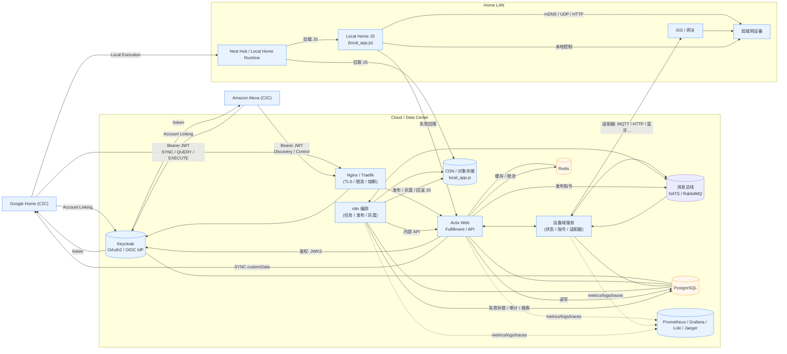

```mermaid
graph LR

%% 客户端平台
GH["Google Home (C2C)"]
AX["Amazon Alexa (C2C)"]
NH["Nest Hub / Local Home Runtime"]

%% 入口/网关
RP["Nginx / Traefik\n(TLS / 限流 / 熔断)"]

%% 核心服务
KC[("Keycloak\nOAuth2 / OIDC IdP")]
ACT["Actix Web\nFulfillment / API"]
DS["设备域服务\n(状态 / 指令 / 适配器)"]
N8N["n8n 编排\n(任务 / 发布 / 灰度)"]
BUS[("消息总线\nNATS / RabbitMQ")]

%% 数据与可观测性
PG[("PostgreSQL")]
RDS[("Redis")]
OBS[("Prometheus / Grafana / Loki / Jaeger")]

%% 本地执行
CDN[("CDN / 对象存储\nlocal_app.js")]
LJS["Local Home JS\n(local_app.js)"]
GW["iSG / 网关"]
DEV["局域网设备"]

%% 云端分组
subgraph Cloud[Cloud / Data Center]
  RP --> KC
  RP --> ACT
  ACT <--> DS
  DS <--> BUS
  N8N <--> BUS
  KC --- PG
  ACT --- PG
  ACT --- RDS
  DS  --- PG
  N8N --- PG
  ACT -.metrics/logs/traces.-> OBS
  DS  -.metrics/logs/traces.-> OBS
  N8N -.metrics/logs/traces.-> OBS
  N8N --> CDN
end

%% 局域网分组
subgraph LAN[Home LAN]
  NH -->|"加载 JS"| LJS
  LJS -->|"mDNS / UDP / HTTP"| DEV
  GW  --> DEV
end

%% C2C OAuth 流程
GH -->|"Account Linking"| KC
AX -->|"Account Linking"| KC
KC -->|"/token"| GH
KC -->|"/token"| AX

%% 云端 Fulfillment
GH -->|"Bearer JWT\nSYNC / QUERY / EXECUTE"| RP
AX -->|"Bearer JWT\nDiscovery / Control"| RP
ACT -->|"鉴权: JWKS"| KC
ACT -->|"读写"| PG
ACT -->|"缓存 / 限流"| RDS
ACT -->|"发布指令"| BUS
BUS --> DS
DS -->|"适配器: MQTT / HTTP / 蓝牙..."| GW

%% Local Execution
GH -->|"Local Execution"| NH
NH -->|"拉取 JS"| CDN
ACT -->|"SYNC customData"| GH
LJS -->|"本地控制"| DEV
LJS -->|"失败回落"| ACT

%% n8n 流程
N8N -->|"失败补偿 / 审计 / 报表"| PG
N8N -->|"发布 / 灰度 / 回滚 JS"| CDN
N8N -->|"内部 API"| ACT

classDef svc fill:#e8f3ff,stroke:#3b82f6,stroke-width:1px
classDef store fill:#fff7ed,stroke:#f59e0b,stroke-width:1px
class KC,ACT,DS,N8N,RP,GH,AX,NH,CDN,LJS,DEV,GW,OBS svc
class PG,RDS store
```
