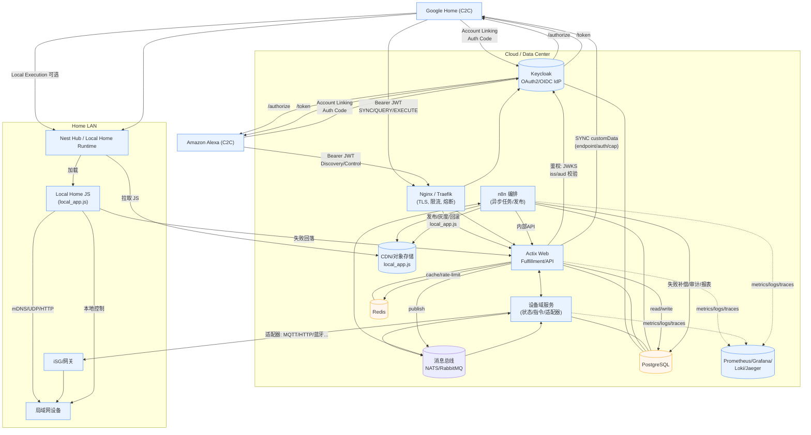

```mermaid
graph TD
  %% =========================
  %% Cloud-to-Cloud + Local Execution Overall Architecture
  %% =========================

  %% Clients / Platforms
  GH["Google Home (C2C)"]
  AX["Amazon Alexa (C2C)"]
  NH["Nest Hub / Local Home Runtime"]

  %% Edge / Ingress
  RP["Nginx / Traefik\n(TLS, 限流, 熔断)"]

  %% Core Services
  KC[("Keycloak\nOAuth2/OIDC IdP")]
  ACT["Actix Web\nFulfillment/API"]
  DS["设备域服务\n(状态/指令/适配器)"]
  N8N["n8n 编排\n(异步任务/发布)"]
  BUS[("消息总线\nNATS/RabbitMQ")]

  %% Data Stores & Observability
  PG[("PostgreSQL")]
  RDS[("Redis")]
  OBS[("Prometheus/Grafana/\nLoki/Jaeger")]

  %% Local Home JS Distribution
  CDN[("CDN/对象存储\nlocal_app.js")]
  LJS["Local Home JS\n(local_app.js)"]

  %% Devices / Gateways
  GW["iSG/网关"]
  DEV["局域网设备"]

  %% Grouping
  subgraph Cloud[Cloud / Data Center]
    RP --> KC
    RP --> ACT
    ACT <--> DS
    DS <--> BUS
    N8N <--> BUS

    KC --- PG
    ACT --- PG
    ACT --- RDS
    DS  --- PG
    N8N --- PG

    ACT -.metrics/logs/traces.-> OBS
    DS  -.metrics/logs/traces.-> OBS
    N8N -.metrics/logs/traces.-> OBS

    N8N --> CDN
  end

  subgraph LAN[Home LAN]
    NH -->|"加载"| LJS
    LJS -->|"mDNS/UDP/HTTP"| DEV
    GW  --> DEV
  end

  %% C2C OAuth Flow
  GH -->|"Account Linking\nAuth Code"| KC
  AX -->|"Account Linking\nAuth Code"| KC
  KC -->|"/authorize"| GH
  KC -->|"/token"| GH
  KC -->|"/authorize"| AX
  KC -->|"/token"| AX

  %% Fulfillment (Cloud)
  GH -->|"Bearer JWT\nSYNC/QUERY/EXECUTE"| RP
  AX -->|"Bearer JWT\nDiscovery/Control"| RP
  RP --> ACT
  ACT -->|"鉴权: JWKS\niss/aud 校验"| KC
  ACT -->|"read/write"| PG
  ACT -->|"cache/rate-limit"| RDS
  ACT -->|"publish"| BUS
  BUS --> DS
  DS -->|"适配器: MQTT/HTTP/蓝牙..."| GW

  %% Local Execution Path
  GH -->|"Local Execution 可选"| NH
  NH -->|"拉取 JS"| CDN
  ACT -->|"SYNC customData\n(endpoint/auth/cap)"| GH
  GH --> NH
  LJS -->|"本地控制"| DEV
  LJS -->|"失败回落"| ACT

  %% n8n Pipelines
  N8N -->|"失败补偿/审计/报表"| PG
  N8N -->|"发布/灰度/回滚\nlocal_app.js"| CDN
  N8N -->|"内部API"| ACT

  %% Notes
  classDef svc fill:#e8f3ff,stroke:#3b82f6,stroke-width:1px
  classDef store fill:#fff7ed,stroke:#f59e0b,stroke-width:1px
  class KC,ACT,DS,N8N,RP,GH,AX,NH,CDN,LJS,DEV,GW,OBS svc
  class PG,RDS store
```
